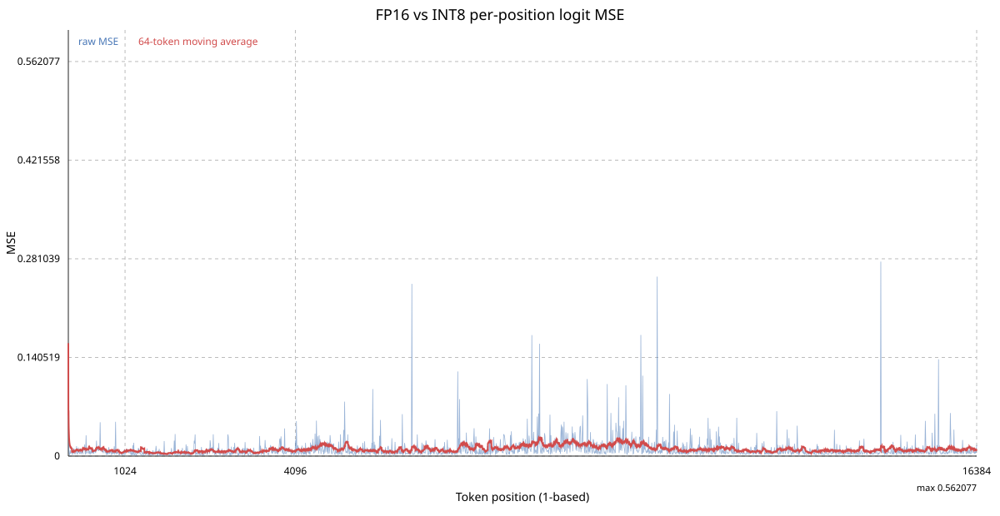
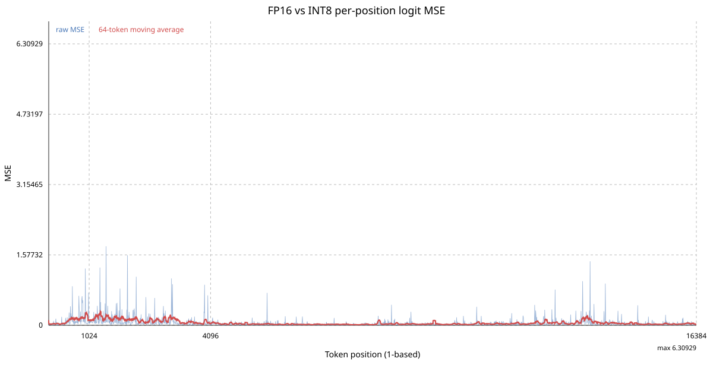

# W8A16 与 W4A16 量化

[English](README.md) | 简体中文

本目录包含共享文件格式及 CUDA W8A16/W4A16 实现。HIP 实现位于 `hip/rwkv_quantized.hip`，
详见 [W7900 移植与验证](../hip/QUANTIZATION.zh-CN.md)。`rwkv_quantize` 将 BF16 RWKV
检查点转换为可流式读取的 `.rwkvq` 文件。线性张量采用逐输出通道对称 INT8 或分组对称
INT4；嵌入、层归一化、LoRA 因子及其他非线性张量保持 BF16。

W4 沿 K 维使用对称有符号 INT4 分组，每字节打包两个值，每个 INT4 张量记录分组大小（32 或 128）：

```bash
rwkv_quantize --format w4a16 --group-size 128 model.pth model.w4a16.rwkvq
rwkv_quantized_smoke model.w4a16.rwkvq
```

CUDA 后端自动识别 `.rwkvq` 文件。INT8 权重驻留设备，注意力投影、FFN 投影和输出头
使用 W8A16 GEMV/GEMM。运行时调优按 GPU/模型形状选择 split-K 与批量算子变体，
将结果持久化到 `--tune-cache` 文件。INT4 张量使用 W4A16 GEMV/Tensor Core 路径和
基于形状的 split-K 选择。HIP 构建也会识别这些文件，并在设备上保留压缩权重；
HIP 使用原始 NK 权重、向量化解码、gfx1100 WMMA 预填充和确定性 split-K，
不使用 CUDA PackedNK 和 CUDA 调优缓存。

## 实测结果

以下为 CUDA 测量，W7900 测量单独记录在 [HIP 验证报告](../hip/QUANTIZATION.zh-CN.md)。

最终测量使用 NVIDIA GeForce RTX 4060 Ti 16 GB（`sm_89`）及 RWKV7 G1J 7.2B、
上下文 16K 模型。解码计时使用独立随机状态、32 token 预填充、三次预热、十次采样，
取第 5、6 个排序样本的中位数。下表 W8A16 数值为运行时调优后的缓存命中结果。

| 批大小 | FP16 ms | W8A16 ms | W8A16 TPS | TPS 提升 |
|---:|---:|---:|---:|---:|
| 1 | 38.0691 | 20.6220 | 48.4919 | +84.6043% |
| 2 | 39.9039 | 21.8185 | 91.6653 | +82.8902% |
| 4 | 43.6685 | 24.2293 | 165.0894 | +80.2301% |
| 8 | 46.1859 | 24.8054 | 322.5104 | +86.1929% |
| 16 | 56.0823 | 28.6889 | 557.7070 | +95.4843% |
| 32 | 58.8945 | 33.8133 | 946.3732 | +74.1755% |
| 64 | 65.8202 | 40.7663 | 1569.9242 | +61.4574% |

所有实测批大小下 W8A16 都更快。解码时间减少 38.1–48.8%，实际吞吐量增加 61.5–95.5%。
相对增益最大的是批大小 16，绝对吞吐量最大的是批大小 64。

1024 token、分块 128 的预填充验收中，FP16 为 512.869 ms，W8A16 为 450.836 ms。
W8A16 耗时减少 12.09%（为 FP16 耗时的 0.8786 倍）。

## 精度与生成差异

教师强制 logit 在相同 token 序列上评估，避免采样分歧影响比较。54 个位置的 logit MSE
为 `0.02647262`，RMSE 为 `0.16270409`，top-1 token 在 53/54 个位置一致（`98.15%`）。
这是数值近似，不是与 FP16 逐位等价。

16K 长上下文检查未发现误差单调累积：

| 输入序列 | 16K 平均 MSE | Top-1 一致 |
|---|---:|---:|
| 固定随机 token | 0.01005010 | 15,579/16,384 (95.09%) |
| 真实英文文本 | 0.05523100 | 15,947/16,384 (97.34%) |

在确定性中文语料上，FP16 困惑度为 `6.385901313`，W8A16 为 `6.391733437`；
绝对差 `0.005832123`，相对差 `0.091328%`。

也将相同贪心 HTTP 请求分别发送到先后运行的 FP16 和 W8A16 服务。
64 个生成 token 的字符级一致率为：

| 提示词 | 字符一致率 |
|---|---:|
| 中文矩阵解释 | 1.000 |
| 英文天空解释 | 0.064 |
| C++ 解释 | 0.689 |

自回归文本可能在首次微小数值差异后发生分歧，因此这些值反映输出稳定性，不能直接作为
质量分数。上面的教师强制 logit 和困惑度（PPL）测量才是受控的精度退化指标。

## 已保存图表

### 随机 token 的 16K logit MSE



### 真实文本的 16K logit MSE



### 中文 PPL 分块分布


可复现的基准和校准程序保留在 `tools/`，由顶层 `CMakeLists.txt` 的 CUDA 部分构建。
